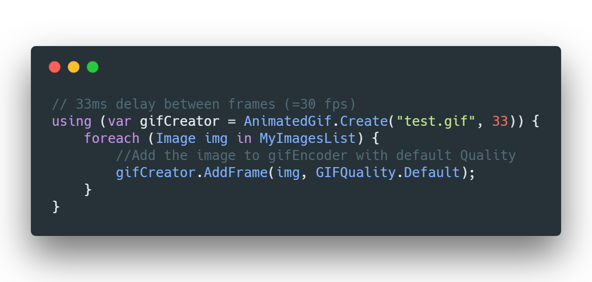
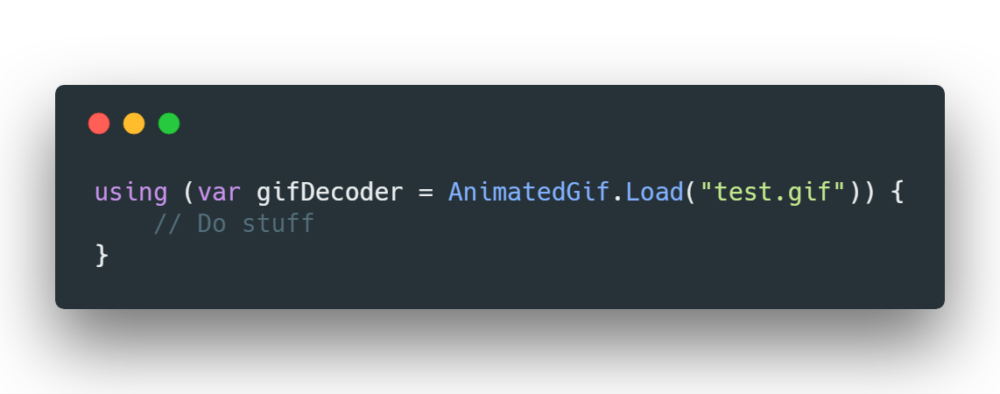

    
    <h1 align="left">Animated GIF</h1>

**AnimatedGif** is a high performance .NET library for **reading and creating animated GIFs**, inspired by the lack of features from the *System.Windows.Media.GifBitmapEncoder*

# How to use

### Add to your Project
* Via NuGet:

Type `Install-Package AnimatedGif` in Package Manager Console or download manually [on NuGet](http://www.nuget.org/packages/AnimatedGif/)

* Manually:

Download or clone this Project and compile on your own and import `AnimatedGif/bin/Release/AnimatedGif.dll`

### Creating a GIF

### Reading a GIF

### Contributing

1. [Fork this Project](https://github.com/mrousavy/AnimatedGif/fork)
2. Change stuff on your Forked repo
3. [Create a pull request](https://github.com/mrousavy/AnimatedGif/compare)

